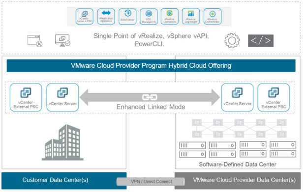
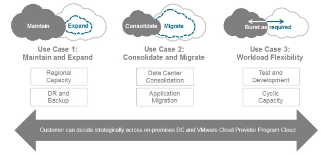
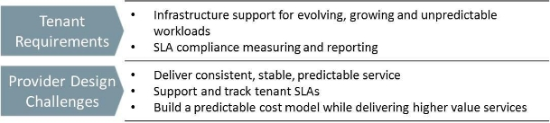
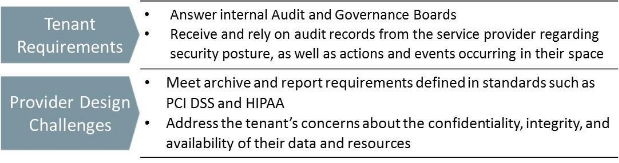
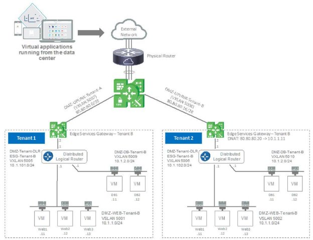
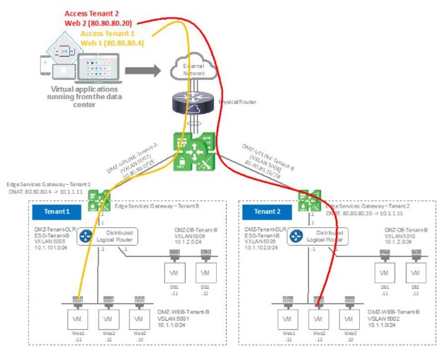
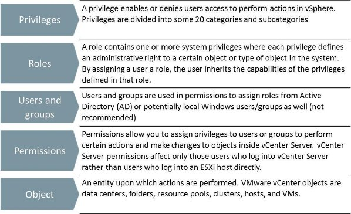
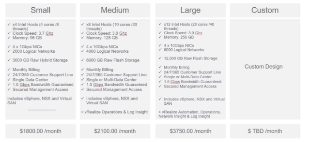

VMware vCloud® Architecture Toolkit™  for Service Providers 

The VMware Cloud Provider™ Program is an ecosystem of over 4,000 service providers located in more
than 100 countries across the globe, offering VMware based cloud services. These local providers protect
data sovereignty while also providing a wide range of differentiated cloud services and market expertise
through specialized compliance and regional certifications.

As the IT landscape rapidly changes through the growth of the mega cloud service providers, cost
reduction pressures, focus on time to market, and employee empowerment are compelling VMware Cloud
Providers to develop innovative strategies to address these challenges.

For many small and mid-market service providers, the cloud approach to service delivery has become a
key area requiring new attention. The abstraction of compute, network, and storage infrastructure is the
foundation of cloud. However, making these components accessible and available to the needs of the
traditional application and container stacks is the new challenge being faced.

In addition, service providers faced with increasingly constrained operational expense budgets are
demanding greater operational efficiency from their infrastructure. The trusted multitenancy model
through VMware vCenter Server® directly addresses this issue through the pre-integrated single pane of
management offered to tenants.

This paper describes two methods of providing this accessibility to consumers and applications: through a
dedicated vCenter Server system and VMware vSphere® infrastructure per tenant, or through a vCenter
Server system with shared access for tenants.

In the shared model, the level of access provided to the vCenter Server system for tenants varies
significantly, depending on the support model. However, to secure and maintain appropriate SLAs in this
type of multitenancy VMware vCenter® architecture, six key pillars must be considered. The following
figure describes these key pillars.

## Introduction

This paper describes two methods of providing this accessibility to consumers and applications: through a *dedicated* vCenter Server system and VMware vSphere® infrastructure per tenant, or through a vCenter Server system with *shared* *access* for tenants.

In the shared model, the level of access provided to the vCenter Server system for tenants varies significantly, depending on the support model. However, to secure and maintain appropriate SLAs in this type of multitenancy VMware vCenter® architecture, six key pillars must be considered. The following figure describes these key pillars.

**Figure 1. Six Key Multitenancy Architectural Pillars**

### vCenter Server Overview

vCenter Server is the most simple and efficient way to manage vSphere hosts. It provides unified management of all the hosts, datastores, and virtual machines (VMs) in the virtual data center from a single web console, with aggregate performance monitoring of clusters, hosts, and VMs. vCenter Server gives service providers and tenants deep insight into the status and configuration of clusters, hosts, VMs, storage, the guest OS, and other critical components of a virtual infrastructure. Other key features of vCenter Server include:

- Centralized control and visibility at every level of virtual infrastructure
- Proactive management of vSphere
- Scalable and extensible management platform with a broad partner ecosystem
- Dynamic allocation of resources using VMware vSphere Distributed Resource Scheduler™ (DRS)
- Storage maps and reports that convey storage usage, connectivity, and configuration
- Customizable topology views and granular role-based access control, which provide visibility into the infrastructure and assist in diagnosis and troubleshooting of issues
- Alerts and notifications that support entities, metrics, and events, such as host, datastore, and VM specific alarms

vCenter Server and vSphere hosts determine the user access level based on the permissions assigned to the user. The combination of user name, password, and permissions is the mechanism by which vCenter Server and vSphere hosts authenticate a tenant or service provider administrator for access and authorize the user to perform activities. vCenter Server maintains a list of authorized users and the permissions assigned to each user. Privileges define basic individual rights that are required to perform actions and read properties. vSphere and vCenter Server use sets of privileges, or roles, to control which users or groups can access particular vSphere objects. You can define different access levels for each tenant object and restrict access using these access levels. This robust permission mechanism and integration with Microsoft Active Directory guarantees authorized access to the tenant environment and its virtual machines, with responsibilities delegated to tenant administrators based on the service design.

## Dedicated vCenter Server Service Design

The dedicated vCenter Server model is one of the most common services offered by VMware Cloud Providers today.

**Figure 2. Dedicated vCenter Server**

Dedicated      Management  vReplication

Components  SevrCveern +te rP SC Appliance SRM Server ManNaSgeXr   (S) OvRpeearalitzioen s LvoRge aInlizseig ht OvrcRheeasliztrea tor

Consumer  

Managed

Network  Edge Firewall  Load Balancing  Distributed  Data Security Services  Services Services Firewall Services Services

VM VM VM VM VM

Software-Defined Data Center

Provider  Managed

Physical Resources

A typical service description for a dedicated vCenter Server offering includes the managed support for a single-tenant dedicated vCenter Server system. This solution gives consumers more control over their environments by providing direct access to the entire inventory of their vCenter Server system to create, modify, and decommission VMs in minutes using the same tools they use on-premises, the vCenter Server user interface and APIs. This means that the service provider’s hosted VMware environment will look and feel like an extension of the customer's data center, and therefore will often include additional VMware products, such as a dedicated VMware NSX® environment, VMware vRealize® Operations Manager™, and VMware vRealize Log Insight™ solutions.

Key advantages to service consumers are described in the following figure.

**Figure 3. Key Advantages of a Dedicated vCenter Server System**

These service offerings also build on the hybrid cloud model, where customers might extend their current service catalog, through vCenter Server, to manage both vSphere environments by way of a single pane of glass, using vCenter Server Enhanced Linked Mode. Whether this is a standard or advanced service offering depends on the service provider’s portfolio.

Service consumers who leverage a vCenter Server-to-vCenter Server hybrid cloud benefit from a truly dynamic infrastructure that can respond to spikes in demand in an instant, or take advantage of features such as cross-site live migration. This model gives consumers near unlimited resource, providing a new level of flexibility when it comes to short-term projects or migrations.

**Figure 4. Dedicated vCenter Server Hybrid Cloud Architecture**

As illustrated in the previous figure, this service model employs vCenter Enhanced Linked Mode to connect two or more vCenter Server objects together, providing the ability to view and search across all linked vCenter Server systems, and to replicate roles, permissions, licenses, and other key data across systems. Enhanced Linked Mode also provides the following features to improve the quality of the end consumer operational experience:

- You can log in to all linked vCenter Server systems simultaneously with a single user name and password.
- You can view and search the inventories of all linked vCenter Server systems within the VMware vSphere Web Client.
- Roles, permission, licenses, tags, and policies are replicated across linked vCenter Server systems.

This solution simplifies a service provider’s ability to provide flexible resource consumption from an end consumer to a VMware Cloud Provider, with a particular focus on the use cases illustrated in the following figure.

**Figure 5. vCenter Server Hybrid Cloud Use Cases**

While the vCenter Server is dedicated, most service providers will employ a level of role-based access control (RBAC) to limit what actions their customers can perform. This provides the benefit to the service provider of always having access to perform troubleshooting activities, and maintenance and patch management. The level of restriction varies by service provider with the demarcation line between provider and consumer clearly defined in the service description and service level agreement.

## Introduction to vCenter Server Multitenancy

The concept of vCenter Server multitenancy is self-explanatory. In its simplest form, multitenancy is the architectural model that optimizes resource sharing, while providing sufficient levels of isolation to the individual tenants, maintaining the agreed upon Quality of Service (QoS) throughout the shared environment.

While most in the industry understand the basic economics of providing a secure multitenancy environment using VMware products, increases in compliance and security requirements are driving service providers and tenants to require more than isolation as a prerequisite for doing business. However, to take advantage of the shared vCenter Server model, illustrated in the following figure, service providers must be able to support multiple tenants within the same physical infrastructure without the tenant being aware of any co-resident. The separation between tenants must be comprehensive, complete, and provide mechanisms for management, reporting, and alerting.

**Figure 6. vCenter Server Multitenancy Model**

This vCenter Server model (illustrated here) uses a layered approach with security controls, isolation mechanisms, and monitoring controls embedded in the network, compute, and storage layers of the service stack. This layered approach provides secure access to the hosts, guarantees resources to tenants, and provides abstraction to the physical components. The VMware software-defined solutions at different layers allow the infrastructure to provide isolation of resources without dedicating a vCenter Server management platform on a per-tenant basis.

This design example uses three tenants. All tenants share the same vCenter Server system, while each tenant has its own virtual compute, network, and storage resources. Resources are allocated for each tenant based on their business model, requirements, and priorities. Traffic between tenants is restricted, separated, and protected through the design of the environment.

**Figure 7. Secure Multitenant Anatomy**

vCenter Server, NSX, vRealize 

& Automation Tools Single Point of vRealize, vAPI, PowerCLI… etc.

SevrvCeern t+e rP SC vAReppplliicaanctioen SRM Server ManNagSeXr   (S) OvRpeearaliztieon s LvoRge aInlizsieg ht OvrcRheeaslitzrea tor  

Customer A Customer B Customer C

 Users Security  Users Security  Users  Security

 Catalogs  Policies   Catalogs Policies   Catalogs  Policies 

Internet

External Network -Internet

Provider Services

**VPN** Edge Gateway **VPN** Edge Gateway **VPN** Edge Gateway 

VM VM VM VM VM VM VM VM VM

The flexibility offered by these vCenter Server based service offerings helps address the challenges facing service providers, including rapidly changing IT landscapes, cost reduction pressures, and focus on time to market.

This type of service offering (shown in the preceding figure) can often be delivered through an IT as a service (ITaaS) model. The ITaaS cloud-computing models, which have been developed by many VMware Cloud Providers to address particular customer use cases, offer a new level of automation and security to successfully achieve application stack autonomy and customer business objectives. ITaaS offers compute resources, operating systems, networking, and storage to client environments. With ITaaS, tenants are typically responsible for all operations and administration, and for configuration of their environment beyond the baseline deployment.

In addition, many VMware Cloud Providers are developing cloud service offerings for public and internal tenant applications, regardless of whether the focus is on public or private cloud services. Typically, these pursuits focus on the following objectives:

- Increase operational efficiency through cost-effective use of expensive infrastructure
- Drive up economies of scale through shared resourcing
- Rapid and agile deployment of customer environments or applications
- Improve service quality and accelerate delivery through standardization
- Promote green computing by maximizing efficient use of shared resources, and therefore lowering energy consumption

Achieving these goals can have a profound, positive impact on profitability, productivity, and product quality. However, leveraging a shared vCenter Server system or shared infrastructure model in a cloud services architecture introduces additional challenges, hindering widespread adoption where end tenants demand a securely isolated application or environment and require a highly flexible management platform.

vSphere with vCenter Server provides secure separation through the inherent security of its own internal software architecture and the capabilities it provides to logically segment tenant assets and resources

through its management interfaces. In the shared vCenter Server model, sharing vSphere hosts among tenants is inherently challenging at a number of different levels. If the service provider’s end goal is to maximize resource utilization through the sharing of host resources across tenants, VMware vCloud Director® for Service Providers is the primary design option. vCloud Director and the additional layer of abstraction it offers to facilitate the sharing of host resources while achieving secure multitenancy is described in Section[ 8, VMware vCloud Director for Service Providers.](#_page32_x69.00_y72.00)

In the architecture illustrated in[ Figure 7,](#_page11_x69.00_y72.00) the construct most commonly adopted VMware Cloud Providers, for the sharing of a vCenter Server platform, is the use of the logical data center object within the vCenter Server inventory. For the segmentation and isolation of tenants, this is the primary design choice for a number of reasons.

Unlike a folder, which is used to organize a specific object type, the data center object is an aggregation of all the different types of objects needed to do work in the virtual infrastructure: hosts, virtual machines, networks, and datastores. The data center defines the namespace for networks and datastores, and the names for these objects must be unique within a data center. For example, you cannot have two datastores with the same name within a single data center, but you can have two datastores with the same name in two different data centers. Virtual machines, templates, and clusters need not be unique within the data center, but must be unique within their folder. In addition, the data center object in vCenter Server creates artificial limits on the operational abilities of the tenants.

There are also several other reasons to use the data center object in a shared vCenter Server design over folders. For instance, while a folder object can contain sub-objects, because the physical hosts are dedicated to the tenant, these sub-objects are best placed within a data center object. The reason for this is, if you switch views in the vSphere Web Client to the Storage View, you will see datastores and datastore clusters contained within the data center. You can create folders in vCenter Server, but they are restricted to that view. Likewise, if you switch to the Networking View, data centers are the containers used for VMware vSphere Distributed Switch™ instances and port groups.

The preference for the data center object over the use of folders becomes obvious when you understand where the network and storage boundaries are (and by association, host boundaries). If you elect to only use folders, the design must include far more complex operational processes to prevent problems, and verify that secure multitenancy is maintained. Therefore, the design recommendation is to use the data center objects for tenant isolation purposes.

As a result of this key design factor, a shared vCenter Server model requires a number of characteristics and design specifications, which are outlined as follows:

- Although it supports multitenancy, data center objects, clusters, hosts, and storage are not shared across multiple tenants.
- In the shared vCenter Server deployment, each customer is treated as a tenant, or for a large enterprise deployment, each individual department in the enterprise is treated as a tenant.
- The data center object is a tenant-specific resource, so all the clusters and hosts inside the data center object are also tenant-specific resources.
- The service provider administrator must be able to control which tenant can access the vCenter Server system, data center objects, clusters, hosts, and storage of the shared vCenter system.
- When the service provider administrator creates the vCenter Server system (for the first time), all the data centers objects, clusters, hosts, and storage in that vCenter Server system do not belong to any tenant until the service provider administrator assigns the appropriate access control lists (ACLs).
- The service provider does not support moving of data center objects across tenants.
- The service provider does not support moving of clusters and hosts across data center objects.
- The service provider does not support moving of a host from one cluster to another or making it non- clustered.
- Tenant administrators must be able to use the hosts and clusters from the shared vCenter Server platform as it pertains to the service description.
- The data center objects, clusters, and hosts that are not part of the tenant's resources will not be visible to that tenant.

## vCenter Server Multitenancy Elements

As outlined previously, to develop a secure and trusted multitenancy service model with vCenter Server, isolation and service assurance are the primary concerns. The “trusted” portion of the model relates to the visibility and control offered to the tenants to verify the environment. To support these fundamental requirements, the trusted multitenant model on the vCenter Server platform must be built on six foundational elements as shown in the following graphic.

**Figure 8. Six Elements of the Shared vCenter Platform**

vCenter Multitenant Model

- Service Management and Control
- Tenant Management and Control
- Secure Separation
- Availability and Data Protection
- Service Assurance
- Security and Compliance

### Design Considerations for Secure Separation

The first element is secure separation. Secure separation refers to the effective segmentation and isolation of tenant’s assets and resources within the multitenant environment. Without secure separation, a trusted multitenant vCenter Server environment cannot exist.

**Figure 9. Secure Separation Design Considerations**

Service assurance plays a critical design role in a shared vCenter Server architecture, providing tenants with a consistent, enforceable, and reliable service level. In a multitenant vCenter Server environment, the service provider must manage virtual resources to accommodate the growth and changing business needs of all tenants. Service level agreements (SLAs) define the level of service agreed upon by tenants and the service provider. Service assurance plays a key role to make sure that tenants receive the agreed upon level of service from network, compute, and storage resources.

A number of methods are available to service providers to deliver consistent SLAs across the network, compute, and storage components of the shared vCenter Server platform, including QoS, limits, and vSphere DRS. However, without the correct mix of service assurance features and capabilities, which are built into vCenter Server and vSphere components, maintaining uptime, throughput, quality of service, and availability SLAs can be challenging.

**Figure 10. Service Assurance Design Considerations**

### Design Considerations for Security and Compliance

The third element, security and compliance, provides the confidentiality, integrity, and availability of each tenant’s environment at every layer of the VMware stack, using technologies like VMware vCenter Single Sign-On identity management and role-based access control, encryption, key management, firewalls, malware protection, and intrusion prevention. This is a key design factor pertinent to both service provider and tenant.

The shared vCenter Server solution must verify that all activities performed in the provisioning, configuration, and management of the multitenant environment, as well as day-to-day activities and events for individual tenants, are verified and continuously monitored. It is also important that all operational events are recorded and that these records are available as evidence during audits. vRealize Log Insight provides the functionality to meet this design requirement.

**Figure 11. Security and Compliance Design Considerations**

In addition, as regulatory compliance expands, the shared vCenter Server environment will become increasingly subject to security and compliance standards, such as PCI DSS, HIPAA, and SOX (GLBA). With the proper tools, achieving and demonstrating compliance is not only possible, but it can often become easier to accomplish than in a non-virtual environment.

### Design Considerations for Availability and Data Protection

Resources and data must be available for use by the tenant. High availability means that resources such as network bandwidth, memory, CPU, or data storage are always online and available to users when needed. Redundant systems, configurations, and architecture can minimize or eliminate points of failure that adversely affect availability to the tenant.

Data protection is a key ingredient in a resilient architecture. Cloud computing imposes a resource tradeoff between high performance, and the requirements of increasingly robust security and data classification are an essential tool for balancing that equation. End customers need to know what data is important and where it is located as a prerequisite to making performance cost-benefit decisions, as well as maintaining focus on the most critical areas for data loss prevention procedures.

**Figure 12. Availability and Data Protection Design Considerations**

### Design Considerations for Tenant Management and Control

The fifth element is tenant management and control. In every shared vCenter Server model there are elements of control that the service provider will delegate to the tenant. Reasons for delegation of control include convenience, new revenue opportunities, security, compliance, or tenant requirement. In all cases, the goal of the shared vCenter Server model is to allow for and simplify the management, visibility, and reporting of this delegation.

Tenants must only have control over relevant portions of their service. Specifically, tenants must be able to provision allocated resources, manage the state of all virtualized objects, and view resource status and performance metrics for all parts of their infrastructure. In addition, where possible through third-party plug-ins into vCenter Server, tenants taking advantage of data protection or data backup services must be able to manage this capability on their own, including setting schedules and backup types, initiating jobs, and running reports.

This tenant-in-control model allows tenants to dynamically change the environment to suit their workloads as resource requirements change within the constructs defined by the service provider.

**Figure 13. Tenant Management and Control Design Considerations**

### Design Considerations for Service Provider Management and Control

The sixth and final element that must be included as a key design factor in the shared vCenter Server model is service provider management and control. One goal of a trusted multitenant vCenter Server architecture is to simplify management of resources at every level of the infrastructure and to provide the functionality to provision, monitor, troubleshoot, and charge back the resources used by tenants. The management of shared vCenter Server multitenant environments comes with challenges, from reporting and alerting to capacity management and tenant control delegation. vCenter Server helps address these challenges by providing a scalable management solution that is tightly integrated into the infrastructure. In addition, vCenter Server provides a rich, fully developed API stack for adding additional service provider value.

VMware Cloud Providers of infrastructure services in a shared vCenter Server multitenant environment require comprehensive control and complete visibility of the shared infrastructure to provide the availability, data protection, security, and service levels expected by tenants. The ability to control, manage, and monitor resources at all levels of the infrastructure requires a dynamic, efficient, and flexible design that allows the service provider to access and provision compute, storage, and network resources from the VMware software-defined data center components quickly, easily, and with minimal effort.

vCenter Server simplifies resource planning for both cloud and tenant environments by displaying detailed CPU and memory allocation at a range of different levels. A service provider administrator can use information provided at the root, data center, or cluster level to get an overview of CPU and memory resources allocated to infrastructure virtual machines and individual tenants. A tenant can use information provided at the data center, or more granular objects level, to get an overview of CPU and memory resource allocated to the virtual machines and their workloads.

Performance charts in vCenter Server provide a single view of all performance metrics at both the data center, cluster, and individual object levels. Information such as CPU, memory, disk, and network can be seen without navigating through multiple charts. Performance charts include aggregated charts that show high-level summaries of resource distribution, which helps administrators identify top tenants. Thumbnail views of virtual machines, hosts, resource pools, clusters, and data stores allow easy navigation to individual charts.

## VMware NSX

VMware NSX provides security and networking solutions for virtual data centers and cloud environments. The NSX product helps strengthen application and data security, further enabling the shared vCenter Server model to improve visibility and control, and accelerate IT compliance efforts across the tenants’ organization. This allows NSX to be used by the service provider to create a multitenant topology by segmenting networks, providing isolation of network resources, logical routing, network security policies, firewalling, and advanced load balancing features.

As illustrated in the following figure, through appropriate design, high-scale multitenancy is enabled with multiple tiers of VMware NSX Edge™ devices interconnected through VxLAN transit uplinks. Two tiers of NSX Edge devices support the required scaling, while maintaining a level of administrative control, with top-tier NSX Edge devices acting as a provider edge managed by the service provider administrator, and a second tier of NSX Edge devices provisioned and managed by the tenants.

The provider edge can scale up to 8 ECMP edges for scalable routing. Depending on the tenants’ requirements, the tenant edges can be ECMP or stateful. In addition, as discussed in the next section, this architecture supports overlapping IP addresses between tenants connected to different first-tier NSX Edge devices, and NSX distributed firewall (DFW) rules in a multitenancy environment.

**Figure 14. Multitenant vCenter Server NSX Architecture**

As the preceding figure shows, in this example each tenant’s virtual network consists of VxLAN logical switches, a NSX distributed logical router (DLR), and an NSX Edge services gateway.

The per-tenant DLR is predominantly employed to improve the efficiency of east-west routing within the tenant’s segments (web and DB segments in this example). Each tenant employs an edge services gateway (ESG) for north-south routing and for the tenant to leverage other network services such as NAT, firewall, and load balancers.

The provider edge will employ a “trunk” interface to allow the creation of many sub-interfaces on the single NSX Edge device, and establish peering with separate DLR instances on each sub-interface.

The aggregation edge gateways must use route import policies to make sure the tenant edge gateways advertise only the appropriate routes.

### Overlapping Tenant IP Addresses and NAT

An additional design factor in the shared vCenter Server model is a scenario where the tenants are controlling their own IP addressing for their VMs, and therefore there is a chance that the tenants’ IP address ranges are going to overlap one another. If two tenants happen to use the same IP addressing to support this scenario, Network Address Translation (NAT) must be performed on each tenant’s ESG to translate the tenants’ IP addresses to uniquely accessible IP addresses.

In the following figure, each tenant has been assigned a unique IP address by the service provider within the range of its ESG’s uplink to ESG-AGGREGATION: Tenant1: 80.80.80.0/28 and Tenant2: 80.80.80.16/28.

If these are the publicly accessible IP addresses assigned to each tenant, which can be reached by its client on the internet, then the tenant will use this IP address range to publish its services to its client on the internet. As illustrated in the following graphic, each of the tenants has a web application running on the WEB VM that needs to be accessed by its client.

NAT must be performed by each tenant ESG. The NAT is essentially a DNAT (Destination NAT) that translates the destination IP address of incoming traffic to IP addresses of the WEB VM.

The orange portions of the following figure illustrate the DNAT on ESG-Tenant1 and the traffic flow when a client is accessing Tenant1’s web application.

**Figure 15. Overlapping IP Multitenancy**

The red portions of the graphic illustrate the DNAT on ESG-Tenant2 and the traffic flow when a client is accessing Tenant2’s web application.

Each tenant has its own ESG. Each ESG is predominantly employed to furnish north-south routing and provide a perimeter firewall for each tenant. Of course, other network services, such as load balancing, can also be activated on the ESG when needed by the tenants. Finally, each VM is fronted with a firewall at its vNIC. This firewall is provided by the distributed firewall (DFW) feature in NSX.

Network multitenancy through the use of NSX can be achieved in the design of your virtual network, within the shared vCenter Server architecture. The use of a distributed logical router (stand-alone or HA) and an NSX Edge gateway per tenant, together with the creation of a backbone network where the tenant network connects to an aggregation edge cluster (HA or ECMP) that then connects back to the outside network, can provide the network and network services isolation required for a multitenant vCenter Server architecture. In this example, the network policies reside on the edge gateway and the distributed logical router per tenant, giving tenants full control over their own network.

However, limitations in the role-based access control provided by NSX means that service design is critical, and the demarcation line of actions performed by the provider and tenant needs to be examined as part of the service design and delivery model.

A final consideration on the topic of NSX in a shared vCenter Server design is that these functions are enabled out-of-the-box when architecting a multitenant environment with vCloud Director for Service Providers, simplifying the architecture and operations and reducing time to market.

## Understanding vCenter Server Role-Based Access Control

One key service design consideration in a shared vCenter Server environment is determining who can use vCenter Server, and what tasks those tenant users are authorized to perform. vCenter Server has a built-in role-based access control mechanism for tenant access and authorization.

RBAC is the security mechanism that can greatly lower the cost and complexity of shared vCenter Server security administration. RBAC simplifies security operations by using roles, hierarchies, and constraints to organize privileges. vCenter Server offers flexible role-based access control to define the roles and privileges for different tenant administrators within the vCenter Server environment.

Roles and privileges in the vCenter Server system can easily be modified and new roles quickly created. Service provider administrators can focus on defining policies needed by their tenants to provision compute infrastructure and network connectivity while provider and tenant collaborate on strategic architectural and security issues. Meanwhile, the implementation of basic server configuration can be automated.

**Figure 16. Role-Based Access Control Architecture**

vCenter Server provides centralized authentication and authorization services at many different levels within its inventory, using user and group rights with roles and privileges. vCenter Server features five main components for managing RBAC. Key concepts in this system are described in the following figure.

**Figure 17. Key Role-Based Access Control Concepts**

If proper role-based access controls are not in place within a shared vCenter Server environment, virtual machines will be vulnerable, because any user with access to the vSphere client can delete or modify the guest operating systems or make changes to other inventory objects, like folders, resource pools, and datastores.

In addition, roles can be customized to include or exclude any of the privileges in vCenter Server. vCenter Server comes with predefined roles. However, you can also customize roles to meet your specific service design and operational needs. vCenter Server predefined roles determine what actions a user or group is allowed to take within vCenter Server nodes across the infrastructure (where a single SSO authentication domain exists) or potentially, directly on VMware ESXi™ hosts, depending on whether or not the hypervisors are domain joined or not. Some roles have one or more privileges, while others have no privileges at all.

Three of the predefined roles are permanent, meaning that you cannot change the privileges associated with these roles. These permanent roles are available to a standalone ESXi server, or to a vCenter Server system. The remaining are sample roles that can be modified as needed. Note that since the release of ESXi 5.1, the creation of custom local groups is not supported on the host directly.

The following table describes the pre-established roles.  **Table 1. Predefined Roles**

|**Roles**  |**Role Type**  |**Description**  |
| - | - | - |
No Access  Permanent  A role that is assigned to new users and groups. Prevents a user

or group from viewing or making changes to an object. Read-Only  Permanent  A role that allows users to check the state of an object or view its

details, but not make changes to it. 

Administrator  Permanent  A role that enables a user complete access to all of the objects

on the server. At least one user must have administrative permissions in VMware. 

Virtual  Sample Role  A role that grants a user access rights to only virtual machines. Machine  The user can alter the virtual hardware or create snapshots of Power User  the VM. 

Virtual  Sample Role  Grants user access rights exclusively to VMs. The user can Machine  power on, power off, and reset the virtual machine, as well as User  run media from the virtual discs. 

Resource  Sample Role  Allows the user to create resource pools (RAM and CPU

Pool  reserved for use) and assign these pools to virtual machines. Administrator 

VMware  Sample Role  Required to allow VMware Consolidated Backup to run (legacy Consolidated  role).

Backup User 

Datastore  Sample Role  Allows the user to consume space on a datastore. Consumer 

Network  Sample Role  Allows the user to assign a network to a virtual machine or a Consumer  host. 

**Note**  When you assign a user permission to manage only a specific VM, when they log into vCenter

Server, they will only see the data center object and that VM (unless permissions have been specifically applied to a higher level). They will not see any other VMs, the ESXi host that the VM is on, clusters, resource pools, and so on.

**Figure 18. vCenter Server Default Roles**

The privileges assigned to a predefined role are more comprehensive than described in the previous table, so if you want to know exactly what permissions a role provides to a user, you can view the selected privileges when assigning the role to a user or group.

VMware automatically allows users access to child objects. For example, if a user has been given read- only rights for a folder, that user will have read-only rights for all of the sub-folders as well. You can disable this setting by selecting do not propagate when allocating roles.

You can change the privileges associated with the predefined roles. Before editing a role, however, VMware recommends that you clone the role first to maintain the default sample roles for future use. It’s a simple task to clone or create a new set of customized roles that map specifically to the requirements of the service provider. For example, you can create custom roles such as one for providing access for rebooting the virtual machines to a particular user. Additional examples of custom roles are described in Section[ 6.2, Examples of Shared vCenter Server Service Roles .](#_page28_x69.00_y72.00)

### Best Practices for Shared vCenter Server RBAC Design

The following is a list of common and best practices for configuring role-based access control within a shared vCenter Server architecture:

- Any permissions granted to a user account for vCenter Server access must be a privileged account.
- All permissions are assigned to AD groups, not user accounts. Do not use local accounts or groups.
- Grant permissions only where needed. Using the minimum number of permissions makes it easier to understand and manage the permissions structure of each tenant.
- Create new groups for vCenter Server tenant and service provider users. Avoid using Windows built- in groups or other existing groups.
- If you assign a restrictive role to a group, check that the group does not contain the Administrator user or other users with administrative privileges. Otherwise, you could unintentionally restrict administrators' privileges in parts of the inventory hierarchy where you have assigned that group the restrictive role.
- Use data center objects or folders to group objects to correspond to tenants, differing the permissions you want to grant for them.
- Use caution when granting a permission at the root vCenter Server level. Users with permissions at the root level have access to global data on vCenter Server, such as roles, custom attributes, vCenter

Server settings, and licenses. Changes to licenses and roles propagate to all vCenter Server systems in an Enhanced Linked Mode group, even if the user does not have permissions on all of the vCenter Server systems in the group.

- In most cases, enable propagation on permissions. This provides that when new objects are inserted into the inventory hierarchy, they inherit permissions and are accessible to tenant admins and users.
- Use the No Access role to mask specific areas of the hierarchy that you do not want particular tenant administrators and users to have access to.
- Certain privileges can be harmful to hosts and should be assigned to tenants only when required. This includes any privilege that allows a user to delete, rename, remove, or create items that can cause data loss or datastores to be filled up. This can cause a denial of service attack on your VMs (for instance, prevent snapshot creation).
- Create roles that are customized to tenant requirements. For example, to create a role for an operations team that is responsible for monitoring VMs, create one that allows VM interactions only (for instance, power on, power off, reset, and console interaction). This allows team members to look at the console of a VM to see what is happening and power-cycle a VM.
- Assign the datastore low-level file operations privilege sparingly. This privilege allows users to upload and download files to a host datastore and can create a security risk.

Other potentially dangerous privileges are in the network and distributed virtual switch categories, which can allow a user to move a VM to any available virtual LAN that is configured on your virtual switches. This can be particularly risky if you have public and private network virtual switches on a host where you definitely do not want a VM moved between them or connected to both at the same time. Assigning the network privileges to your tenant administrators and denying them to everyone else is a good practice.

### Examples of Shared vCenter Server Service Roles

The following table includes some examples of service provider and tenant vCenter Server roles that can be adopted to enforce customized RVAC and delegation of duties within a shared vCenter Server service that requires a wide range of operational administrator duties for tenants.

**Table 2. Examples of Shared vCenter Server Service Roles **

**vCenter Server  Objects  Propagate  Role Type  Description  Role  Applied to**

| Tenant Administrator          | Data center object or cluster    | Yes | Custom Role | This is a custom role that grants permissions required to manage the tenant’s resources. All permissions other than ones that affect global roles, data center creation, and vCenter Server configuration. |
|-------------------------------|----------------------------------|-----|-------------|------------------------------------------------------------------------------------------------------------------------------------------------------------------------------------------------------------|
| Virtual Machine User          | Data center object, folders, VMs | Yes | Sample Role | This is a built-in VMware role that grants the abilities to access the console of the VM, attach a floppy/CD to the VM, and power on/off/reboot the VM.                                                    |
| Virtual Machine Administrator | Data center object, folders, VMs | Yes | Custom Role | This is a custom role that allows a user total control of a virtual machine or a host, up to and including removing that VM or host.                                                                       |
| Console User                  | Folders, VMs                     | No  | Custom Role | This is a custom role that grants users console-only access of a virtual machine.                                                                                                                          |

**Note**  It is often quicker to clone an existing role and modify the permissions as opposed to creating a new role and starting from scratch. However, both options exist and are equally valid when implementing a shared vCenter Server RBAC solution.

There are also a few other things to keep in mind when configuring access controls for tenants in vCenter Server. First, if a group is assigned a role, all the users in that group are given those same privileges unless the users have roles of their own already assigned. Second, if a user is assigned privileges in VMware, those privileges take precedence over the privileges of the group.

### VMware vCenter Single Sign-On

The VMware vCenter Single Sign-On role is integrated into the VMware Platform Services Controller™ component of vCenter Server, and provides an authentication broker and a security token exchange. The aim of the vCenter Single Sign-On is to provide a secure, centralized way of accessing a mixed vSphere solution with multiple vCenter Server instances as well as other VMware products.

vCenter Single Sign-On is used to form the authentication domain in a vSphere infrastructure. When the user logs into vCenter Server, either through the vSphere Web Client or an API, they first connect with the SSO server, which will typically be integrated to a directory service such as Microsoft Active Directory. When logging in, a SAML 2.0 token is generated for that user, which is then exchanged as user credentials for that user to log into vCenter Server.

vCenter Server also validates the users and groups in Windows Active Directory against the users and groups in vCenter Server through SSO. Therefore, if a user or group exists in vCenter Server, but does not exist in the domain, VMware will delete the permissions associated with the user or group during validation.

It is important to recognize that without an operational SSO service there will be no access to vCenter Server. Therefore, it is the first component that needs to be designed and implemented to achieve a stable mechanism to gain access to the shared vCenter Server infrastructure. For this reason, Platform Services Controller high availability is a key design factor required to provide consistent and reliable access to the platform.

### Host-Based Authentication

While this is unlikely to be employed by a service provider to give host access to tenants, it is worth highlighting that ESXi hosts can be Domain Joined by service provider administrators to allow for centralized authentication and RBAC. Auditing for such a solution can be provided by vRealize Log Insight.

## Metering and Chargeback Design

There are multiple models employed by service providers to meter and invoice end consumers. For instance, both the vCenter Server design options discussed in this paper have relied upon a dedicated host hardware model. While other physical resources might be shared, such as network switches or array-based storage, the ESXi host server resources are only being consumed by a single tenant. Where this is the case, the service provider might invoice their customers based on the host hardware being consumed, rather than actual CPU and memory resource being utilized, because those metrics become largely irrelevant, other than perhaps power consumption. Pricing and packaging models, like those illustrated in the following figure, are commonplace among many of the service providers who provide both dedicated and shared vCenter Server service offerings.

**Figure 19. Dedicated vCenter Server Example Pricing and Packaging**

*Disclaimer: The pricing and packing shown here are fictitious, and not based on any service providers P&P model.*

However, there is also an alternate means of billing customers, which might provide a more agile or deterministic approach to pricing and packaging. VMware vRealize Business™ for Cloud is an end-to-end cost reporting solution for virtual environments that enables accurate cost measurement, analysis, and reporting of virtual machines using vSphere. Virtual machine resource consumption data is collected from vCenter Server, providing the most complete and accurate tabulation of resource costs. Integration with vCloud Director and NSX also enables automated chargeback for private and public cloud environments.

The key features required when designing a metering solution that provides the most complete and accurate tabulation of resource costs include the following:

- Map IT cost to business units, cost centers, or external consumers, thereby enabling a better understanding of how much resources cost and what can be done to optimize resource utilization.
- Support for policy-driven accountability for self-service environments so that business owners can pay as they go for cloud resources.
- Support for allocation-based costing, utilization-based costing, or a combination of both to fit a service provider’s unique costing policies.
- Allow consumers to baseline costs, have fixed costs, one-time costs, multiple rate factors, and over usage fees to model true costs.
- Meter all resources managed in vCenter Server, including network traffic, public IP addresses, and other services such as DHCP, NAT, and firewalling.
- Provide detailed reports generated for tenants to facilitate decision making and planning.
- Allow service providers to see the actual cost of the cloud infrastructure required to support business services.
- Verify that cost models can be customized to different tenants’ processes and policies.

## VMware vCloud Director for Service Providers

VMware vCloud Director gives customers the ability to build secure private clouds that dramatically increase data center efficiency and business agility. Coupled with vSphere, vCloud Director delivers cloud computing for existing data centers by pooling virtual infrastructure resources and delivering them to users as catalog-based services.

Many of the limitations discussed in this paper regarding secure access control, isolation, and operational efficiency are addressed through the use of vCloud Director. For instance, as highlighted previously, sharing host resources across tenants provides a number of challenges from a secure tenant isolation perspective, as well as a resource management and service assurance point of view. These are the challenges that vCloud Director for Service Providers is designed to resolve. In addition, vCloud Director offers end consumers simple self-service and consumption of advanced network services (offered by NSX) through the vCloud Director user interface and API.

**Figure 20. NSX Self-Service Delivery in vCloud Director**

vCloud Director provides secure separation because administrators can group users into organizations that can represent any policy group, such as a business unit, division, or subsidiary company. Each group has isolated virtual resources, independent LDAP authentication, specific policy controls, and unique catalogs.

These features enable a multitenant environment with multiple organizations sharing the same infrastructure. Visibility and resource control are restricted to each organization virtual data center (VDC).

When employing vCloud Director, tenant management and control is provided by a self-service portal, which provides direct access to individual tenant catalogs and virtual data centers. Tenants consume resources as a catalog-based service through a web portal and programmatic interfaces.

**Figure 21. vCloud Director Architecture**

**Organization Organization**

` `****

 Users Access Control  Users Access Control  Catalogs Provisioning Policies  Catalogs Provisioning Policies

User Clouds User Clouds

vApp vApp

VM VM VM (VMs with  VM VM (VMs with 

vApp Network) vApp Network)

Organization  Organization VDCs VDCs

**vSphere**

vApp Network

Organization VDC Network Organization VDC Network Logical Switches External Networks (SDN)

` `****

Clusters Organization VDCs Organization VDCs Organization VDC Resource Pools

**Provider  VDC: Gold Provider  VDC: Silver Provider  VDC: Bronze** Storage Policies

 Provider Physical Resources 

By standardizing processes, increasing automation, and delivering IT as a service through vCloud Director, it is possible to achieve additional savings beyond virtualization, while significantly reducing the required hands-on operational maintenance of the shared vCenter Server model. In addition, standardizing service offerings can simplify IT management tasks such as troubleshooting, patching, and change management. Administrative maintenance can be eliminated and provisioning can be automated through policy-based workflows that allow authorized users to deploy preconfigured services when they need them.

vCloud Director offers a number of benefits over the shared vCenter Server model discussed in this paper. However, there is no correct or incorrect way of offering end consumers the services and resources they require to conduct their day-to-day business. In fact, one of the key differentiators for VMware Cloud Providers is that many simply focus on the services their customers want to access, and help them build their businesses based on that trusted relationship.

## Transitioning from a Shared vCenter Server Model to vCloud

Director

Several times in this paper we have discussed the benefits of a vCloud Director-based service over that of a shared vCenter Server model. However, what are the options available to help service providers transition consumers from one model to the other? Prior to vCloud Director 8.20, this could leave service provider operational teams with a number of challenges. The *Adopt a vCenter* feature, new in vCloud Director 8.20, simplifies these actions significantly by discovering and assuming the management of existing vCenter Server resource pools without interruption or downtime. This feature helps import existing resources into vCloud Director, and as a result, reduces the time and expense involved in managing and scripting custom multitenancy in vCenter Server. Other benefits include the following:

- Reduced cost and time to maintain custom code required to individually manage separate, dedicated managed environments or shared vCenter Server environments
- Reduced cost and time for third-party integrations
- Enabling self-service (optional)
- Achieving better economies of scale

In addition to shared platforms, many “Dedicated Private Cloud” providers have realized that certain very small, dedicated *micro vCenter* *Server* environments require too much overhead to manage, and have very low margins, in that there is typically a great amount of time and expense involved in managing a dedicated environment, even if it is very small and does not generate much revenue. Therefore, as cloud services continue to become mainstream to consumers, many customers are increasingly comfortable with shared environments. For these use cases, the ability to adopt existing dedicated vCenter Server instances, discovered into vCloud Director, better aligns cost, revenue, and management overhead for these very small vCenter Server environments.

## Design Considerations for vRealize Operations and vRealize Log

Insight

Two other VMware components that often get offered alongside both dedicated and shared vCenter Server-based services are vRealize Operations Manager and vRealize Log Insight.

vRealize Operations Manager delivers intelligent operations management across the physical, virtual, and cloud infrastructure, enabling the VMware Cloud Provider and their tenants to efficiently operate a cloud platform and meet required service level agreements (SLAs). vRealize Operations Manager correlates data from applications to storage in a unified easy-to-use management tool that provides control over performance, capacity, and configuration, with predictive analytics driving proactive policy-based automation.

Like vCenter Server, vRealize Operations Manager can offer a variety of architectural models, depending on the service providers use case. These include:

- Shared multitenant environment with tenant and service provider access
- Dedicated environment with tenant access
- Shared and/or dedicated environment with no tenant access

**Figure 22. vRealize Operations Manager Multitenancy Architecture**

 Overview Dashboard Tenant 1 Tenant 1 Dashboards

Service

Provider  Capacity Dashboard Tenant 2 Tenant 2 Dashboards

Admin

Tenant 3 VM Configuration Workload Dashboard Common Dashboards

For more information on integrating vRealize Operation Manager with dedicated or shared vCenter Server services, see the *Multitenant Use of vRealize Operations as a Service* paper: at [http://www.vmware.com/content/dam/digitalmarketing/vmware/en/pdf/vcat/vmware-multitenant-vrealize- operations-as-a-service.pdf.](http://www.vmware.com/content/dam/digitalmarketing/vmware/en/pdf/vcat/vmware-multitenant-vrealize-operations-as-a-service.pdf)

vRealize Log Insight gives service providers and tenant administrators the ability to consolidate logs, monitor, and troubleshoot vSphere and third-party infrastructure, and perform security auditing, compliance testing, log querying, aggregation, correlation, and retention. The vRealize Log Insight virtual appliance includes a syslog server, log consolidation tool, and log analysis tool that will work for any type of device that can send syslog data. vRealize Log Insight administrators can also create custom dashboards based on saved queries that can be exported, shared, and integrated with vCenter Server and vRealize Operations Manager to provide a uniform approach to dashboard monitoring and operational management.

For more information on integrating vRealize Log Insight with dedicated or shared vCenter Server services, see the *Architecting a VMware vRealize Log Insight Solution for the VMware Cloud Provider Program* paper at[ http://www.vmware.com/content/dam/digitalmarketing/vmware/en/pdf/vcat/vmware- architecting-a-vmware-vrealize-log-insight-solution.pdf.](http://www.vmware.com/content/dam/digitalmarketing/vmware/en/pdf/vcat/vmware-architecting-a-vmware-vrealize-log-insight-solution.pdf)

## Conclusion

The ability to deliver infrastructure services to multiple external consumers is a core component of a service provider’s business. VMware provides many opportunities for service providers to deliver secure dedicated services to multiple tenants, whether the architectural model is based on a dedicated vCenter Server platform, a shared vCenter Server platform, or a vCloud Director platform. By providing multiple trusted multitenancy options, service providers can address the key concerns of tenants in a multitenant environment: confidentiality, security, compliance, service levels, availability, data protection, and management control.

VMware uses a layered approach, with security controls, isolation mechanisms, and monitoring controls embedded in the network, compute, and storage layers of the infrastructure. This layered approach provides secure access to the cloud resources, guaranteeing resources to tenants, and providing abstraction of the physical elements away from the tenants through the software-defined data center, which allows the infrastructure to provide logical isolation without dedicating physical resources to each tenant.

Effective, efficient coordination and management of the vCenter Server platform and other VMware components and processes across the infrastructure are critical to delivering IaaS and the confidentiality and security of tenant data, which is a fundamental requirement of a multitenant environment. Again, the following six foundational elements form the basis of any VMware Cloud Provider Program secure multitenant model:

- **Secure Separation** – Provides that the resources of existing tenants remain untouched and uncompromised when new tenants are provisioned. vCenter Server, ESXi, and NSX provide secure separation methods at every layer of the shared converged infrastructure to safeguard the security and privacy of each tenant.
- **Service Assurance** – Provides tenants with consistent and reliable service levels that accommodate their growth and changing business needs. Various methods are available from VMware to deliver consistent service level agreements (SLAs) and optimize quality of service across the network, compute, and storage components of the platform.
- **Security and Compliance** – Maintains the confidentiality, integrity, and availability of each tenant’s environment. The VMware software-defined data center provides security at every layer of the shared infrastructure using technologies such as identity management and access control, encryption and key management, firewalls, malware protection, and intrusion prevention.
- **Availability and Data Protection** – Provides that resources such as network bandwidth, memory, CPU, or data storage are always online and available to tenants when needed. The VMware software-defined data center provides a secured environment by using threat detection and mitigation, including the monitoring and response to intrusions and attacks against the environment and its tenants.
- **Tenant Management and Control** – Allows tenants to change the environment to suit their workloads as resource requirements change.
- **Service Management and Control** – Simplifies management of resources at every level of the infrastructure, and provides the functionality to provision, monitor, troubleshoot, and charge for the resources used by tenants. The VMware software-defined data center platform helps address these challenges by providing scalable, integrated management solutions inherent to the infrastructure and a rich, fully developed API stack for adding additional service provider value.

VMware Cloud Providers are extensively involved in designing, testing, and validating the VMware software-defined data center with innovative technologies, platforms, and solutions at the network, compute, storage, layers. VMware Cloud Providers can use these tested solutions to deploy secure and trusted public and private clouds. By using these solutions as a reference guide, they can create a trusted infrastructure that is secure, flexible, highly functional, and interoperable to generate revenue by providing value-added services.